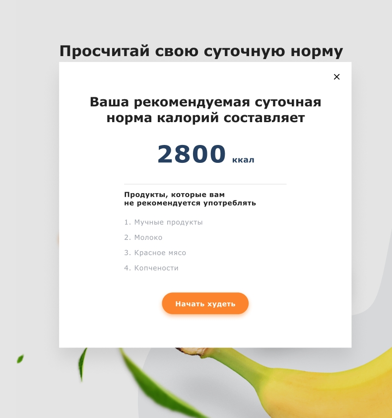
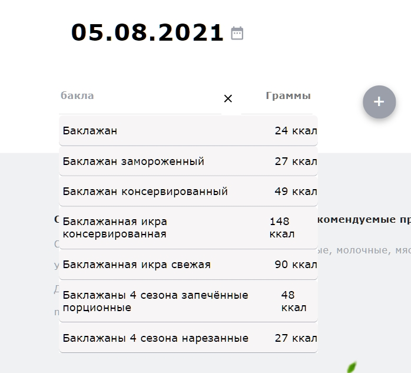
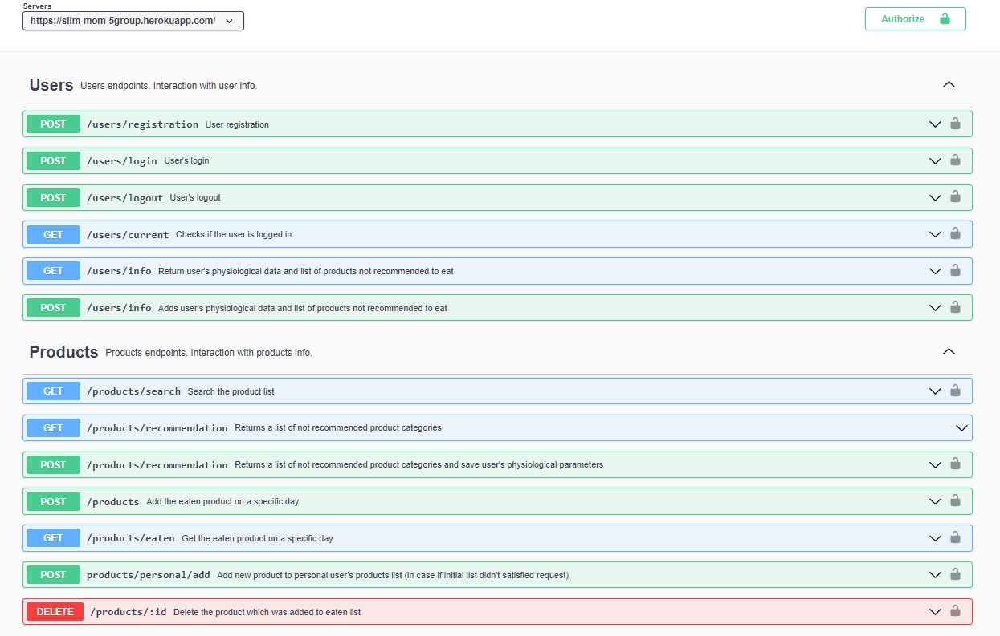
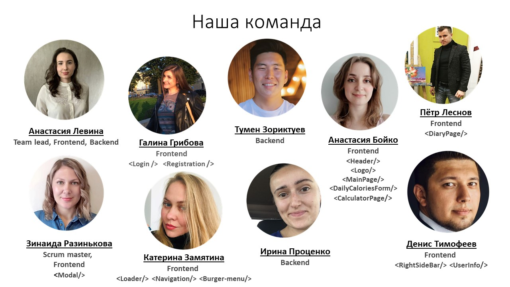

# Худей легко!

## Если хочешь похудеть, а держать в голове список съеденых продуктов не для тебя. Тогда быстрее регистрируйся в нашем приложении и веди свой личный дневник для похудения.

### Web-приложение [Slim Mom](https://slimmom5group.netlify.app/) предоставляет тебе возможность бесплатно хранить данные на сервере, иметь к ним доступ и наглядно вести учет употребленных продуктов за день.

#

## Описание

#

При первом знакомстве с приложением необходимо заполнить короткую форму для
корректной обработки данных именно под тебя). При успешной регистрации в личном
дневнике: будет всегда выведена информация про список продуктов от которых стоит
воздержаться и рекомендуемое количесто килокалорий в день.

Приложение предоставляет возможность подключиться с любого удобного устройства:
телефон, планшет, компьютер. Ежедневно ты сможешь добавлять и удалять в список:
продукты и их количесто, употребленных за день. И подробный список продуктов,
съеденных за весть день, будет сохранен для дальнейшего просмотра истории по
дням.

Приложения будет доступно после авторизации пользователя !

#

## Фронт-часть приложения [Slim Mom](https://github.com/Anastasia-spl/slim-mom-frontend):

## Бэк-часть приложения [Slim Mom](https://github.com/Anastasia-spl/slim-mom-backend):

#

## Для удобства можно просмотреть весь список путей, которые использываются в реализации этого приложения. Полное руководство описано на [slimmpm_api_docs](https://slim-mom-5group.herokuapp.com/api-docs/).

#

## Команда разработчиков:

#

- ## [Анастасия Левина ](https://github.com/Anastasia-spl/)
- ## [Галина Грибова ](https://github.com/Axeliriya)
- ## [Тумен Зориктуев ](https://github.com/TMNZKTV)
- ## [Анастасия Бойко ](https://github.com/BoikoAnastasiia)
- ## [Пётр Леснов ](https://github.com/Lesnov-Petr)
- ## [Зинаида Разинькова ](https://github.com/Zinaida-Razinkova)
- ## [Катерина Замятина ](https://github.com/Katerina-Zamiatina)
- ## [Ирина Проценко ](https://github.com/PIrenka)
- ## [Денис Тимофеев ](https://github.com/TMFV)

#
